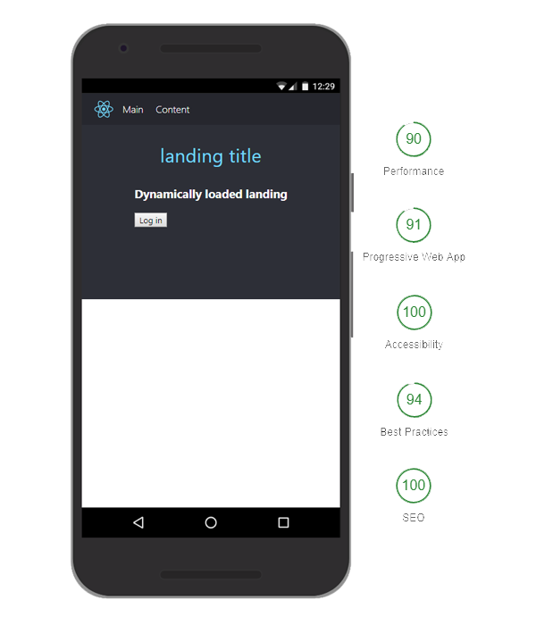

# `pretty-typed-react-starter`

 [](https://badge.fury.io/js/pretty-typed-react-starter)


Create React apps (with Typescript) with no build configuration.

* [Getting Started](#tldr) – How to use 'create react app'.

_Do you know react and want to try out typescript? Or do you know typescript and want to try out react?_ Get all the benefits from `create-react-app` but you use typescript! 🚀

## How to start

```sh
npm install -g create-react-app

create-react-app my-app --scripts-version pretty-typed-react-starter
cd my-app/
npm start or yarn start
```

## About

This is a variation of the 'create react app' with custom scripts and template. Full `Progressive Web App (PWA)` integration is implemented in this project with offline-first strategy, custom splash screen, icons and configurable service worker.



#### note about Lighthouse results:

_To make the result a 5x 100 you need to try server-side rendering for the main component, enable HTTPS and use 'cache-control' header for the serviceWorker file on your server_

## Features:

* [TypeScript](https://www.typescriptlang.org/)
* [Prettier](https://prettier.io/) - _note:_ replaced ES/TSlint. To make it work you need to install it in your editor (for more info check out the official documentation)
* [MobX](https://mobx.js.org/) - Easier than Redux yet equally powerfull and fun to use.
* [React Loadable](https://github.com/jamiebuilds/react-loadable) - Code-splitting made easy. Works great with current webpack configuration from create react app. Example included in the template.
* [Sass](https://sass-lang.com/) - CSS preprocessor with `node-sass-chokidar` package
* [React Router](https://github.com/ReactTraining/react-router) - basic routing with PWA support (HashRouter)
* [Workbox](https://developers.google.com/web/tools/workbox/) - with `workbox` i replaced standard approach to PWA that was shipped with default `create-react-app` config. The service worker is now fully configurable in `/src/serviceWorker`. It is pre-configured in `Webpack` to include `.js .html and .css` files in the precache manifest but exclude any images.

## Project structure

```
my-app
├── README.md
├── node_modules
├── tsconfig.json
├── images.d.ts
├── package.json
├── .gitignore
├── public
│   └── favicon.ico
│   └── index.html
│   └── manifest.json
└── src
    └── index.tsx
    └── registerServiceWorker.ts
    └── Components
        └── Content
            └── dynamic.tsx
            └── index.tsx
            └── types.ts
            └── styles.scss
        └── ...
    └── Containers
        └── ContentContainer
            └── dynamic.tsx
            └── index.tsx
            └── types.ts
            └── styles.scss
        └── ...
    └── Utils
        └── colors.scss
        └── constants.ts
        └── helpers.ts
        └── store.ts
```

## Concept

The project structure is created with separation of logic from view and code-splitting in mind.
Ideally you keep your logic in the `Containers` and view in `Components`.
Typical structure for a `Container/Component` would be :

```
Container/Component
    └── index.tsx (main file)
    └── dynamic.tsx (dynamically loaded export made from react-loadable
    └── types.ts (exported types)
    └── styles.scss (styles for that specific Container/Component)
```

## Changelog

### 0.2.14

* added meta tag with description in `index.html`
* added baseUrl in `tsconfig.json`

### 0.2.13

* removed dynamically loaded chunks from the precache manifest

### 0.2.10

* added runtime routing for workbox

### 0.2.7

* added splash screen images

### 0.2.6

* change from `BrowserRouter`to `HashRouter`
* user can now refresh page with route applied in offline mode (everything now properly points to `index.html`)

### 0.2.0

* added basic support for `Workbox`
* removed old files
